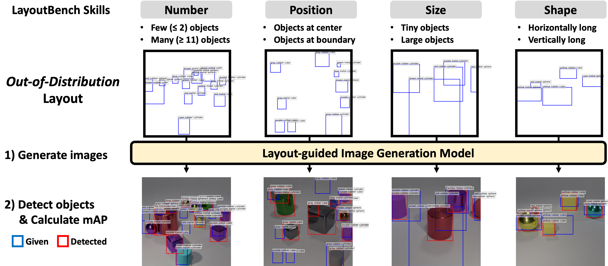

# LayoutBench

The evaluation code for **LayoutBench**, a new diagnostic benchmark for layout-guided image generation, as described in the paper:

**[Diagnostic Benchmark and Iterative Inpainting for Layout-Guided Image Generation (CVPR 2024 Workshop)](https://layoutbench.github.io/)**

[Jaemin Cho](https://j-min.io),
[Linjie Li](https://www.microsoft.com/en-us/research/people/linjli/),
[Zhengyuan Yang](https://zyang-ur.github.io/),
[Zhe Gan](https://zhegan27.github.io/),
[Lijuan Wang](https://www.microsoft.com/en-us/research/people/lijuanw/),
[Mohit Bansal](https://www.cs.unc.edu/~mbansal/)

[[Project Page](https://layoutbench.github.io/)]
[[Paper](https://arxiv.org/abs/2304.06671)]
[[Dataset (HF Hub)](https://huggingface.co/datasets/j-min/layoutbench)]


**NEW (Jul. 2024):** Please also see [LayoutBench-COCO Github](https://github.com/j-min/LayoutBench-COCO) for LayoutBench-COCO dataset for OOD layouts with real-world objects.



# Env Setup

```bash
pip install -r evaluation/detr/requirements.txt
```

# Dataset

We host the dataset via Hugging Face Hub. Please download the dataset [https://huggingface.co/datasets/j-min/layoutbench](https://huggingface.co/datasets/j-min/layoutbench) and place it in the `datasets/` directory.

```bash
mkdir datasets && cd datasets
git clone https://huggingface.co/datasets/j-min/layoutbench
```

# Evaluation with pretrained DETR

## Download pretrained DETR checkpoint

```bash
mkdir evaluation/checkpoint/ && cd evaluation/checkpoint/
wget https://huggingface.co/j-min/LayoutBench-DETR/resolve/main/checkpoint.pth
mv checkpoint.pth layoutbench_detr_ckpt.pth
```

## Evaluation on LayoutBench splits

`SKILL_SPLIT` should be one of the following:
`number_few`, `number_many`, `position_boundary`, `position_center`, `size_tiny`, `size_large`, `shape_horizontal`, `shape_vertical`


```bash
cd evaluation

LAYOUTBENCH_DIR='../datasets/layoutbench'
DETR_CKPT_PATH='checkpoint/layoutbench_detr_ckpt.pth'
SKILL_SPLIT='number_few' # skill split to evaluate
RUN_NAME='run' # name of the run
N_GPUS=4 # number of gpus
OUTPUT_DIR=output/$SKILL_SPLIT # directory to save the output

torchrun --nnodes=1 --nproc_per_node=$N_GPUS \
  detr/main.py \
  --batch_size 40 \
  --no_aux_loss \
  --eval \
  --backbone 'resnet101' \
  --dilation  \
  --dataset_file 'layoutbench_v1'  \
  --num_classes 48  \
  --resume $DETR_CKPT_PATH  \
  --layoutbench_dir $LAYOUTBENCH_DIR  \
  --skill_split $SKILL_SPLIT \
  --output_dir $OUTPUT_DIR \ 
  --save_viz # (optional) whether to save visualization
```

## Example outputs on LayoutBench

The following are the example outputs for LayoutBench skill splits with the above command.
They correspond to paper's Table 2 first row -- `GT (Oracle)`.
There are minor variations in APs (<1%) due to package/hardward version differences.
The following outputs are calculated with torch==2.0.0 on A6000 GPUs with [our offical DETR checkpoint](https://huggingface.co/j-min/LayoutBench-DETR).

### Example output for `number_few` split

<details>
  <summary>Click me</summary>

```bash
IoU metric: bbox
 Average Precision  (AP) @[ IoU=0.50:0.95 | area=   all | maxDets=100 ] = 0.944
 Average Precision  (AP) @[ IoU=0.50      | area=   all | maxDets=100 ] = 0.997
 Average Precision  (AP) @[ IoU=0.75      | area=   all | maxDets=100 ] = 0.990
 Average Precision  (AP) @[ IoU=0.50:0.95 | area= small | maxDets=100 ] = 0.894
 Average Precision  (AP) @[ IoU=0.50:0.95 | area=medium | maxDets=100 ] = 0.982
 Average Precision  (AP) @[ IoU=0.50:0.95 | area= large | maxDets=100 ] = 1.000
 Average Recall     (AR) @[ IoU=0.50:0.95 | area=   all | maxDets=  1 ] = 0.949
 Average Recall     (AR) @[ IoU=0.50:0.95 | area=   all | maxDets= 10 ] = 0.958
 Average Recall     (AR) @[ IoU=0.50:0.95 | area=   all | maxDets=100 ] = 0.958
 Average Recall     (AR) @[ IoU=0.50:0.95 | area= small | maxDets=100 ] = 0.916
 Average Recall     (AR) @[ IoU=0.50:0.95 | area=medium | maxDets=100 ] = 0.987
 Average Recall     (AR) @[ IoU=0.50:0.95 | area= large | maxDets=100 ] = 1.000
```
</details>

### Example output for `number_many` split

<details>
  <summary>Click me</summary>

```bash
IoU metric: bbox
 Average Precision  (AP) @[ IoU=0.50:0.95 | area=   all | maxDets=100 ] = 0.923
 Average Precision  (AP) @[ IoU=0.50      | area=   all | maxDets=100 ] = 0.990
 Average Precision  (AP) @[ IoU=0.75      | area=   all | maxDets=100 ] = 0.986
 Average Precision  (AP) @[ IoU=0.50:0.95 | area= small | maxDets=100 ] = 0.866
 Average Precision  (AP) @[ IoU=0.50:0.95 | area=medium | maxDets=100 ] = 0.968
 Average Precision  (AP) @[ IoU=0.50:0.95 | area= large | maxDets=100 ] = 0.999
 Average Recall     (AR) @[ IoU=0.50:0.95 | area=   all | maxDets=  1 ] = 0.829
 Average Recall     (AR) @[ IoU=0.50:0.95 | area=   all | maxDets= 10 ] = 0.946
 Average Recall     (AR) @[ IoU=0.50:0.95 | area=   all | maxDets=100 ] = 0.946
 Average Recall     (AR) @[ IoU=0.50:0.95 | area= small | maxDets=100 ] = 0.900
 Average Recall     (AR) @[ IoU=0.50:0.95 | area=medium | maxDets=100 ] = 0.980
 Average Recall     (AR) @[ IoU=0.50:0.95 | area= large | maxDets=100 ] = 0.999
```
</details>

### Example output for `position_center` split

<details>
  <summary>Click me</summary>

```bash
IoU metric: bbox
 Average Precision  (AP) @[ IoU=0.50:0.95 | area=   all | maxDets=100 ] = 0.911
 Average Precision  (AP) @[ IoU=0.50      | area=   all | maxDets=100 ] = 0.995
 Average Precision  (AP) @[ IoU=0.75      | area=   all | maxDets=100 ] = 0.987
 Average Precision  (AP) @[ IoU=0.50:0.95 | area= small | maxDets=100 ] = 0.859
 Average Precision  (AP) @[ IoU=0.50:0.95 | area=medium | maxDets=100 ] = 0.964
 Average Precision  (AP) @[ IoU=0.50:0.95 | area= large | maxDets=100 ] = -1.000
 Average Recall     (AR) @[ IoU=0.50:0.95 | area=   all | maxDets=  1 ] = 0.873
 Average Recall     (AR) @[ IoU=0.50:0.95 | area=   all | maxDets= 10 ] = 0.938
 Average Recall     (AR) @[ IoU=0.50:0.95 | area=   all | maxDets=100 ] = 0.940
 Average Recall     (AR) @[ IoU=0.50:0.95 | area= small | maxDets=100 ] = 0.899
 Average Recall     (AR) @[ IoU=0.50:0.95 | area=medium | maxDets=100 ] = 0.977
 Average Recall     (AR) @[ IoU=0.50:0.95 | area= large | maxDets=100 ] = -1.000
```
</details>


### Example output for `position_boundary` split

<details>
  <summary>Click me</summary>

```bash
IoU metric: bbox
 Average Precision  (AP) @[ IoU=0.50:0.95 | area=   all | maxDets=100 ] = 0.911
 Average Precision  (AP) @[ IoU=0.50      | area=   all | maxDets=100 ] = 0.996
 Average Precision  (AP) @[ IoU=0.75      | area=   all | maxDets=100 ] = 0.991
 Average Precision  (AP) @[ IoU=0.50:0.95 | area= small | maxDets=100 ] = 0.856
 Average Precision  (AP) @[ IoU=0.50:0.95 | area=medium | maxDets=100 ] = 0.960
 Average Precision  (AP) @[ IoU=0.50:0.95 | area= large | maxDets=100 ] = 0.999
 Average Recall     (AR) @[ IoU=0.50:0.95 | area=   all | maxDets=  1 ] = 0.869
 Average Recall     (AR) @[ IoU=0.50:0.95 | area=   all | maxDets= 10 ] = 0.932
 Average Recall     (AR) @[ IoU=0.50:0.95 | area=   all | maxDets=100 ] = 0.933
 Average Recall     (AR) @[ IoU=0.50:0.95 | area= small | maxDets=100 ] = 0.888
 Average Recall     (AR) @[ IoU=0.50:0.95 | area=medium | maxDets=100 ] = 0.972
 Average Recall     (AR) @[ IoU=0.50:0.95 | area= large | maxDets=100 ] = 1.000
```
</details>


### Example output for `size_tiny` split

<details>
  <summary>Click me</summary>

```bash
IoU metric: bbox
 Average Precision  (AP) @[ IoU=0.50:0.95 | area=   all | maxDets=100 ] = 0.828
 Average Precision  (AP) @[ IoU=0.50      | area=   all | maxDets=100 ] = 1.000
 Average Precision  (AP) @[ IoU=0.75      | area=   all | maxDets=100 ] = 0.998
 Average Precision  (AP) @[ IoU=0.50:0.95 | area= small | maxDets=100 ] = 0.828
 Average Precision  (AP) @[ IoU=0.50:0.95 | area=medium | maxDets=100 ] = -1.000
 Average Precision  (AP) @[ IoU=0.50:0.95 | area= large | maxDets=100 ] = -1.000
 Average Recall     (AR) @[ IoU=0.50:0.95 | area=   all | maxDets=  1 ] = 0.826
 Average Recall     (AR) @[ IoU=0.50:0.95 | area=   all | maxDets= 10 ] = 0.861
 Average Recall     (AR) @[ IoU=0.50:0.95 | area=   all | maxDets=100 ] = 0.862
 Average Recall     (AR) @[ IoU=0.50:0.95 | area= small | maxDets=100 ] = 0.862
 Average Recall     (AR) @[ IoU=0.50:0.95 | area=medium | maxDets=100 ] = -1.000
 Average Recall     (AR) @[ IoU=0.50:0.95 | area= large | maxDets=100 ] = -1.000
```
</details>


### Example output for `size_large` split

<details>
  <summary>Click me</summary>

```bash
IoU metric: bbox
 Average Precision  (AP) @[ IoU=0.50:0.95 | area=   all | maxDets=100 ] = 0.966
 Average Precision  (AP) @[ IoU=0.50      | area=   all | maxDets=100 ] = 0.994
 Average Precision  (AP) @[ IoU=0.75      | area=   all | maxDets=100 ] = 0.992
 Average Precision  (AP) @[ IoU=0.50:0.95 | area= small | maxDets=100 ] = 0.473
 Average Precision  (AP) @[ IoU=0.50:0.95 | area=medium | maxDets=100 ] = 0.965
 Average Precision  (AP) @[ IoU=0.50:0.95 | area= large | maxDets=100 ] = 0.989
 Average Recall     (AR) @[ IoU=0.50:0.95 | area=   all | maxDets=  1 ] = 0.946
 Average Recall     (AR) @[ IoU=0.50:0.95 | area=   all | maxDets= 10 ] = 0.978
 Average Recall     (AR) @[ IoU=0.50:0.95 | area=   all | maxDets=100 ] = 0.979
 Average Recall     (AR) @[ IoU=0.50:0.95 | area= small | maxDets=100 ] = 0.618
 Average Recall     (AR) @[ IoU=0.50:0.95 | area=medium | maxDets=100 ] = 0.979
 Average Recall     (AR) @[ IoU=0.50:0.95 | area= large | maxDets=100 ] = 0.993
```
</details>


### Example output for `shape_horizontal` split

<details>
  <summary>Click me</summary>

```bash
IoU metric: bbox
 Average Precision  (AP) @[ IoU=0.50:0.95 | area=   all | maxDets=100 ] = 0.901
 Average Precision  (AP) @[ IoU=0.50      | area=   all | maxDets=100 ] = 0.989
 Average Precision  (AP) @[ IoU=0.75      | area=   all | maxDets=100 ] = 0.971
 Average Precision  (AP) @[ IoU=0.50:0.95 | area= small | maxDets=100 ] = 0.756
 Average Precision  (AP) @[ IoU=0.50:0.95 | area=medium | maxDets=100 ] = 0.928
 Average Precision  (AP) @[ IoU=0.50:0.95 | area= large | maxDets=100 ] = 0.996
 Average Recall     (AR) @[ IoU=0.50:0.95 | area=   all | maxDets=  1 ] = 0.889
 Average Recall     (AR) @[ IoU=0.50:0.95 | area=   all | maxDets= 10 ] = 0.929
 Average Recall     (AR) @[ IoU=0.50:0.95 | area=   all | maxDets=100 ] = 0.933
 Average Recall     (AR) @[ IoU=0.50:0.95 | area= small | maxDets=100 ] = 0.816
 Average Recall     (AR) @[ IoU=0.50:0.95 | area=medium | maxDets=100 ] = 0.953
 Average Recall     (AR) @[ IoU=0.50:0.95 | area= large | maxDets=100 ] = 0.997
```
</details>

### Example output for `shape_vertical` split

<details>
  <summary>Click me</summary>

```bash
IoU metric: bbox
 Average Precision  (AP) @[ IoU=0.50:0.95 | area=   all | maxDets=100 ] = 0.890
 Average Precision  (AP) @[ IoU=0.50      | area=   all | maxDets=100 ] = 0.984
 Average Precision  (AP) @[ IoU=0.75      | area=   all | maxDets=100 ] = 0.966
 Average Precision  (AP) @[ IoU=0.50:0.95 | area= small | maxDets=100 ] = 0.757
 Average Precision  (AP) @[ IoU=0.50:0.95 | area=medium | maxDets=100 ] = 0.910
 Average Precision  (AP) @[ IoU=0.50:0.95 | area= large | maxDets=100 ] = 0.981
 Average Recall     (AR) @[ IoU=0.50:0.95 | area=   all | maxDets=  1 ] = 0.887
 Average Recall     (AR) @[ IoU=0.50:0.95 | area=   all | maxDets= 10 ] = 0.922
 Average Recall     (AR) @[ IoU=0.50:0.95 | area=   all | maxDets=100 ] = 0.925
 Average Recall     (AR) @[ IoU=0.50:0.95 | area= small | maxDets=100 ] = 0.799
 Average Recall     (AR) @[ IoU=0.50:0.95 | area=medium | maxDets=100 ] = 0.941
 Average Recall     (AR) @[ IoU=0.50:0.95 | area= large | maxDets=100 ] = 0.984
```
</details>


# Citation

If you find our project useful in your research, please cite the following paper:

```bibtex
@inproceedings{Cho2024LayoutBench,
  author    = {Jaemin Cho and Linjie Li and Zhengyuan Yang and Zhe Gan and Lijuan Wang and Mohit Bansal},
  title     = {Diagnostic Benchmark and Iterative Inpainting for Layout-Guided Image Generation},
  booktitle = {The First Workshop on the Evaluation of Generative Foundation Models},
  year      = {2024},
}
```
